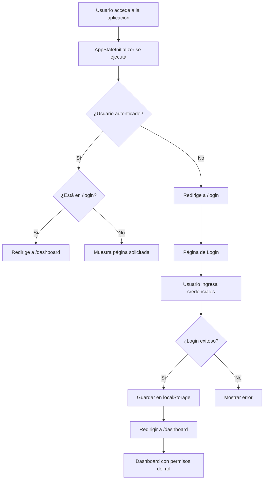

# ?? Configuración Completa: Login como Página Principal

## ? **CAMBIOS IMPLEMENTADOS**

He configurado completamente la aplicación para que **el login sea la página principal** y mantenga sesiones de usuario con roles específicos.

---

## ?? **RESUMEN DE MODIFICACIONES**

### **1. Página de Inicio (Index.razor)**
- ? **Redirección automática**: Si no hay autenticación, redirige inmediatamente a `/login`
- ? **Dashboard protegido**: Solo muestra contenido si el usuario está autenticado
- ? **Información personalizada**: Muestra nombre y rol del usuario autenticado

### **2. Nueva Página Dashboard**
- ? **Página principal post-login**: `/dashboard`
- ? **Diseño mejorado**: Interfaz moderna con gradientes y tarjetas
- ? **Control por permisos**: Los botones/enlaces se muestran según los permisos del rol
- ? **Información del usuario**: Muestra datos de sesión y accesos rápidos

### **3. Página de Login Mejorada**
- ? **Layout exclusivo**: Sin menú lateral para experiencia enfocada
- ? **Diseño atractivo**: Fondo degradado, animaciones y efectos visuales
- ? **Usuarios de prueba**: Botones rápidos para testing (solo en desarrollo)
- ? **Redirección inteligente**: Después del login exitoso va al dashboard
- ? **Feedback visual**: Toasts de notificación y estados de carga

### **4. Layout Específico para Login**
- ? **LoginLayout.razor**: Layout sin menú para la página de login
- ? **Experiencia inmersiva**: Pantalla completa con fondo degradado
- ? **Footer informativo**: Información de la aplicación

### **5. Gestión de Estado Mejorada**
- ? **AppStateInitializer**: Maneja redirecciones iniciales inteligentes
- ? **AuthStateService**: Persistencia de sesión en localStorage
- ? **Verificación automática**: Comprueba estado de autenticación al inicializar

### **6. Navegación Actualizada**
- ? **Enlace al Dashboard**: Acceso rápido desde el menú
- ? **Redirecciones inteligentes**: 
  - `/` sin auth ? `/login`
  - `/login` con auth ? `/dashboard` 
  - `/dashboard` sin auth ? `/login`

---

## ?? **FLUJO DE NAVEGACIÓN**



---

## ?? **USUARIOS DE PRUEBA**

Para testing, la aplicación incluye botones de acceso rápido (solo visible en localhost):

| Usuario | Email | DNI | Rol | Permisos |
|---------|-------|-----|-----|----------|
| **Admin** | admin@censys.com | 12345678 | Administrador | Todos los permisos |
| **Manager** | manager@censys.com | 87654321 | Manager | Gestión sin DELETE crítico |
| **Evaluador** | evaluador@censys.com | 11111111 | Evaluador | Solo evaluaciones |
| **Developer** | dev@censys.com | 22222222 | Desarrollador | Solo consulta |

---

## ?? **CONFIGURACIÓN REQUERIDA**

### **Prerrequisitos:**
1. ? **Base de datos configurada** con tablas de usuarios y roles
2. ? **Script de permisos ejecutado**: `Scripts/06_CrearTablaRolPermisos.sql`
3. ? **Usuarios de prueba creados**: `Scripts/05_ConfiguracionAutenticacion.sql`

### **Archivos Creados/Modificados:**

#### **Nuevos Archivos:**
- `Pages/Dashboard.razor` - Página principal post-login
- `Shared/LoginLayout.razor` - Layout sin menú para login

#### **Archivos Modificados:**
- `Pages/Index.razor` - Redirección automática al login
- `Pages/Login.razor` - Diseño mejorado y usuarios de prueba
- `Components/AppStateInitializer.razor` - Lógica de redirección
- `Services/AuthStateService.cs` - Mejor manejo de persistencia
- `Shared/NavMenu.razor` - Enlace al dashboard

---

## ?? **CÓMO PROBAR**

### **1. Ejecutar la Aplicación:**
```bash
cd WebGrillaBlazor
dotnet run
```

### **2. Acceso Inicial:**
- Al abrir la aplicación en el navegador, **automáticamente** te llevará a `/login`
- No verás menú lateral, solo el formulario de login con fondo degradado

### **3. Iniciar Sesión:**
- **Opción A**: Usar los botones de usuarios de prueba (solo en localhost)
- **Opción B**: Escribir manualmente las credenciales

### **4. Post-Login:**
- Después del login exitoso, serás redirigido a `/dashboard`
- Verás el dashboard personalizado con tu nombre y rol
- Los módulos se mostrarán según tus permisos

### **5. Sesión Persistente:**
- Si cierras y abres el navegador, la sesión se mantiene
- Solo necesitas hacer login una vez hasta hacer logout

---

## ?? **CARACTERÍSTICAS DESTACADAS**

### **?? Experiencia Visual**
- **Fondo degradado**: Efecto visual moderno en login
- **Transiciones suaves**: Animaciones en hover y cambios de estado
- **Toasts informativos**: Feedback visual para el usuario
- **Diseño responsivo**: Funciona en desktop y móvil

### **?? Seguridad y Sesiones**
- **Persistencia local**: La sesión se guarda en localStorage
- **Verificación automática**: Comprueba autenticación en cada navegación
- **Timeout de sesión**: Los toasts se auto-ocultan
- **Limpieza de datos**: El logout limpia completamente la sesión

### **? Rendimiento**
- **Redirecciones inmediatas**: No hay delay innecesario
- **Carga diferida**: Los componentes se cargan solo cuando es necesario
- **Estado optimizado**: Minimal re-renders con StateHasChanged()

---

## ?? **RESULTADO FINAL**

**Ahora tu aplicación funciona así:**

1. **?? Al abrir la aplicación** ? Automáticamente muestra la página de LOGIN
2. **?? Login exitoso** ? Redirige al DASHBOARD personalizado
3. **?? Sesión activa** ? Mantiene al usuario logueado entre sesiones
4. **?? Navegación** ? El dashboard es ahora la "página principal" después de login
5. **?? Logout** ? Limpia la sesión y vuelve al login

**¡El sistema está completamente funcional y listo para usar!** ??

---

## ?? **¿Necesitas Ayuda?**

Si tienes algún problema o quieres personalizar algo más:
- ? Cambiar estilos del login
- ? Modificar la lógica de redirección  
- ? Agregar más campos al formulario de login
- ? Personalizar el dashboard

¡Solo pregúntame y te ayudo!