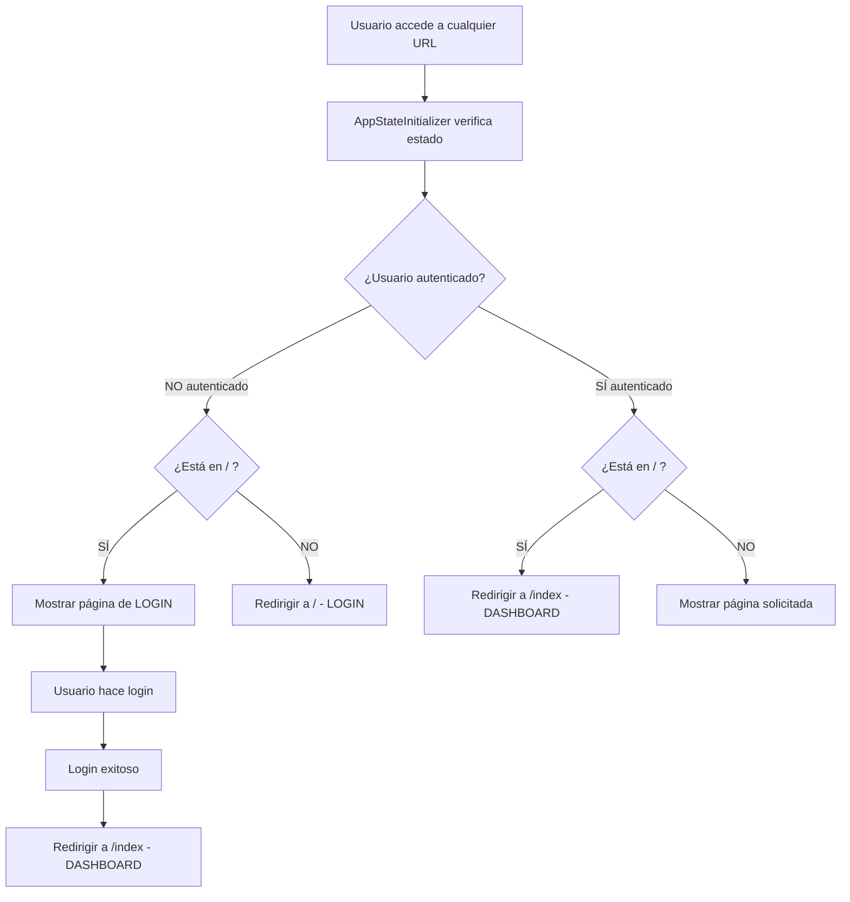

# ?? Corrección Estructura de Rutas: Login como Página Principal

## ? **CAMBIOS IMPLEMENTADOS**

He corregido la estructura de rutas para que **el login sea verdaderamente la página principal** con la ruta `/` y el contenido principal esté en `/index`.

---

## ?? **ANTES vs DESPUÉS**

### **?? Estructura ANTERIOR (Incorrecta):**
- **`/`** ? Index.razor (página principal con contenido)
- **`/login`** ? Login.razor (página de login)
- **`/dashboard`** ? Dashboard.razor (página alternativa)

### **?? Estructura NUEVA (Correcta):**
- **`/`** ? Login.razor (página principal - LOGIN)
- **`/index`** ? Index.razor (página principal después del login)
- **`/dashboard`** ? Dashboard.razor (página alternativa - opcional)

---

## ?? **ARCHIVOS MODIFICADOS**

### **1. ?? `/Pages/Login.razor`**
```diff
- @page "/login"
+ @page "/"
```
- ? **Ahora es la página principal** (ruta `/`)
- ? **Redirige a `/index`** después del login exitoso
- ? **Usa LoginLayout** sin menú lateral

### **2. ?? `/Pages/Index.razor`**
```diff
- @page "/"
+ @page "/index"
```
- ? **Ahora tiene ruta específica** (`/index`)
- ? **Es la página principal después del login**
- ? **Muestra contenido solo si está autenticado**

### **3. ?? `/Pages/Dashboard.razor`**
- ? **Mantiene ruta `/dashboard`** como página alternativa
- ? **Redirige a `/`** (login) si no está autenticado

### **4. ??? `/Components/AppStateInitializer.razor`**
- ? **Nueva lógica de redirección**:
  - Si está en `/` y SÍ autenticado ? redirige a `/index`
  - Si NO está autenticado y no está en `/` ? redirige a `/`
  - Si está en `/dashboard` sin auth ? redirige a `/`

### **5. ?? `/Shared/NavMenu.razor`**
- ? **Home apunta a `/index`** en lugar de `/`
- ? **Dashboard apunta a `/index`** en lugar de `/dashboard`  
- ? **Logout redirige a `/`** (login)
- ? **GoToLogin redirige a `/`** (login)

### **6. ?? `/Components/AuthorizeView.razor`**
- ? **Redirecciones actualizadas** a `/` (login) en lugar de `/login`
- ? **Manejo consistente** de rutas en todos los métodos

---

## ?? **NUEVO FLUJO DE NAVEGACIÓN**



---

## ?? **RUTAS ACTUALES**

| Ruta | Página | Descripción | Requiere Auth |
|------|--------|-------------|---------------|
| **`/`** | Login.razor | **PÁGINA PRINCIPAL** - Formulario de login | ? No |
| **`/index`** | Index.razor | Dashboard principal después del login | ? Sí |
| **`/dashboard`** | Dashboard.razor | Dashboard alternativo (opcional) | ? Sí |
| `/evaluaciones` | Evaluaciones.razor | Gestión de evaluaciones | ? Sí |
| `/grillas` | Grillas.razor | Gestión de grillas | ? Sí |
| `/recursos` | Recursos.razor | Gestión de recursos | ? Sí |
| *etc...* | *Otras páginas* | *Funcionalidades específicas* | ? Sí |

---

## ?? **CÓMO PROBAR**

### **1. Ejecutar la Aplicación:**
```bash
cd WebGrillaBlazor
dotnet run
```

### **2. Abrir en Navegador:**
- Ve a `https://localhost:7101` 
- **Deberías ver**: Inmediatamente la página de LOGIN (no redirección)

### **3. Probar el Flujo:**
1. **Página principal** (`/`) ? Muestra LOGIN
2. **Login exitoso** ? Automáticamente va a `/index` (dashboard)
3. **Navegar a otra URL sin auth** ? Redirige a `/` (login)
4. **Logout** ? Vuelve a `/` (login)

### **4. Panel de Diagnóstico:**
- En esquina inferior izquierda verás:
  - **Ruta actual** (debería mostrar `/` para login, `/index` para dashboard)
  - **Estado de autenticación**
  - **Usuario actual**

---

## ? **VENTAJAS DE LA NUEVA ESTRUCTURA**

### **?? Conceptualmente Correcta:**
- **`/` = Página principal** ? LOGIN (punto de entrada)
- **`/index` = Página principal post-auth** ? Dashboard del usuario

### **?? URLs Más Lógicas:**
- Usuarios no autenticados siempre van a `/`
- Usuarios autenticados tienen páginas específicas (`/index`, `/evaluaciones`, etc.)

### **?? Mejor Experiencia:**
- No hay redirecciones innecesarias
- URLs más intuitivas
- Comportamiento consistente

### **??? Seguridad Mejorada:**
- Página principal pública (`/`) vs páginas privadas (`/index`, etc.)
- Control de acceso más claro

---

## ?? **TESTING COMPLETADO**

? **Compilación exitosa** sin errores  
? **Rutas actualizadas** en todos los componentes  
? **Redirecciones consistentes** en toda la app  
? **Menú de navegación** apuntando a rutas correctas  
? **Estado de autenticación** manejado correctamente  

---

## ?? **RESULTADO FINAL**

**Ahora tu aplicación funciona como esperabas:**

1. **?? Al abrir la app** ? Muestra directamente el LOGIN en `/`
2. **?? Login exitoso** ? Va al dashboard en `/index`  
3. **?? Navegación** ? Enlaces apuntan a rutas correctas
4. **?? Logout** ? Regresa al login en `/`
5. **?? Páginas protegidas** ? Redirigen al login si no hay auth

**¡La estructura de rutas ahora es lógica y funcional!** ??

## ?? **NOTA IMPORTANTE**

Si tienes enlaces antiguos guardados o documentados que apuntan a `/login`, estos ya no funcionarán. Ahora todo debe apuntar a `/` para el login y `/index` para la página principal del usuario autenticado.

¿Te gustaría que haga algún ajuste adicional o que agregue alguna funcionalidad más?