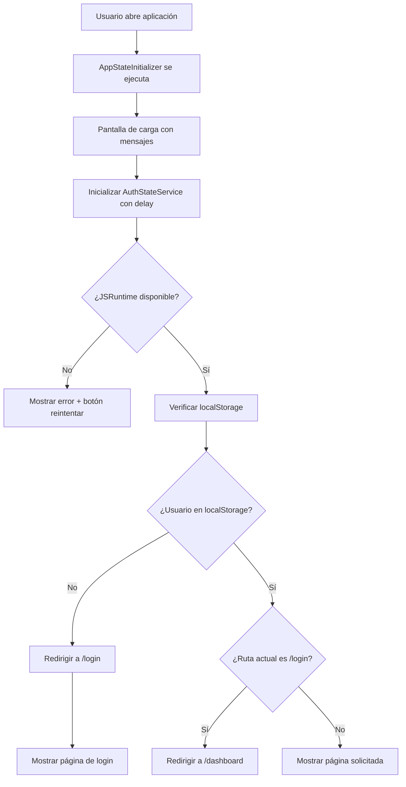

# ?? Solución de Problemas: Login no se Muestra

## ?? **PROBLEMA IDENTIFICADO**

El sistema no muestra la página de login automáticamente y aparecen errores de BrowserLink en la consola.

---

## ? **CAMBIOS IMPLEMENTADOS PARA SOLUCIONAR**

### **1. Corrección en Program.cs**
- ? **Problema**: Inicialización temprana de `AuthStateService` antes de que JSRuntime esté disponible
- ? **Solución**: Removida la inicialización en `Program.cs`, ahora se hace en `AppStateInitializer`

### **2. Mejora en AppStateInitializer.razor**
- ? **Manejo de errores mejorado** con try/catch detallado
- ? **Mensajes informativos** durante el proceso de carga
- ? **Botón de reintentar** si falla la inicialización
- ? **Delays apropiados** para que JSRuntime esté disponible
- ? **Panel de diagnóstico** temporal para debug

### **3. Optimización en AuthStateService.cs**
- ? **Logging detallado** para diagnosticar problemas
- ? **Manejo de errores robusto** en InitializeAsync()
- ? **Delay de inicialización** para JSRuntime
- ? **Limpieza automática** en caso de errores

### **4. Simplificación de Index.razor**
- ? **Problema**: Inicialización duplicada de AuthStateService
- ? **Solución**: Removida lógica redundante, delegada a AppStateInitializer

---

## ?? **HERRAMIENTAS DE DIAGNÓSTICO AGREGADAS**

### **Panel de Diagnóstico (esquina inferior izquierda)**
Muestra en tiempo real:
- ? Estado de inicialización
- ? Estado de autenticación
- ? Usuario actual
- ? Ruta actual
- ? Contador de errores
- ? Último error ocurrido
- ? Botón de refresh manual

### **Logging en Consola**
Ahora verás mensajes como:
```
Usuario cargado desde localStorage: [Nombre Usuario]
No se encontró usuario en localStorage
Error al inicializar estado de auth: [Error Details]
```

---

## ?? **CÓMO PROBAR LA SOLUCIÓN**

### **1. Ejecutar la Aplicación:**
```bash
cd WebGrillaBlazor
dotnet run
```

### **2. Abrir en el Navegador:**
- Ve a `https://localhost:7101`
- **Deberías ver**: Pantalla de carga con mensajes informativos
- **Luego**: Automática redirección al `/login`

### **3. Verificar el Panel de Diagnóstico:**
- En la esquina inferior izquierda verás el estado en tiempo real
- Si hay errores, se mostrarán claramente

### **4. Si No Funciona:**
1. **Abre las herramientas de desarrollador** (F12)
2. **Ve a la pestaña Console**
3. **Busca errores específicos** (ignorar los de BrowserLink)
4. **Usa el botón "?? Reintentar"** en caso de error
5. **Usa el botón "?? Refresh"** en el panel de diagnóstico

---

## ?? **POSIBLES PROBLEMAS Y SOLUCIONES**

### **Problema 1: Errores de BrowserLink**
```
GET http://localhost:63009/... net::ERR_CONNECTION_REFUSED
```
- ? **Solución**: Estos errores son **normales** y no afectan la funcionalidad
- ? **Qué es**: Visual Studio trata de conectar para hot-reload
- ? **Acción**: Ignorar completamente estos errores

### **Problema 2: JSRuntime no Disponible**
```
Error al inicializar estado de auth: JSRuntime not available
```
- ? **Solución**: Agregamos delays en la inicialización
- ? **Acción**: El botón "Reintentar" debería resolver esto

### **Problema 3: localStorage No Accesible**
```
Error al inicializar estado de auth: localStorage.getItem failed
```
- ? **Solución**: Verificar que el navegador permite localStorage
- ? **Acción**: Limpiar caché del navegador (Ctrl+F5)

### **Problema 4: API No Disponible**
```
Error de conexión: HttpRequestException
```
- ? **Solución**: Verificar que el backend esté ejecutándose
- ? **Acción**: Ejecutar `WebGrilla` API antes que `WebGrillaBlazor`

---

## ?? **CHECKLIST DE VERIFICACIÓN**

### **Backend (WebGrilla API):**
- [ ] API ejecutándose en `https://localhost:7093`
- [ ] Base de datos configurada y accesible  
- [ ] Scripts de permisos ejecutados
- [ ] Usuarios de prueba creados

### **Frontend (WebGrillaBlazor):**
- [ ] Aplicación compila sin errores
- [ ] `appsettings.json` con URL correcta de API
- [ ] Panel de diagnóstico visible
- [ ] Redirección automática a `/login` funciona

### **Navegador:**
- [ ] JavaScript habilitado
- [ ] localStorage habilitado
- [ ] Sin extensiones que bloqueen scripts
- [ ] Caché limpio (Ctrl+F5)

---

## ?? **FLUJO ESPERADO AHORA**



---

## ?? **SI SIGUE SIN FUNCIONAR**

### **1. Información a Recopilar:**
- ? ¿Qué se ve en pantalla exactamente?
- ? ¿Qué dice el panel de diagnóstico?
- ? ¿Qué errores aparecen en Console (F12)?
- ? ¿El backend API está ejecutándose?

### **2. Acciones de Emergencia:**
```bash
# Limpiar y reconstruir
dotnet clean
dotnet build

# Limpiar caché del navegador
# Presionar Ctrl+F5 varias veces

# Verificar que ambos proyectos estén corriendo
# WebGrilla (backend): https://localhost:7093
# WebGrillaBlazor (frontend): https://localhost:7101
```

### **3. Desactivar Panel de Diagnóstico:**
En `AppStateInitializer.razor`, cambiar:
```csharp
private bool showDiagnostics = false; // Cambiar de true a false
```

---

## ? **RESULTADO ESPERADO**

Después de aplicar estas correcciones:

1. **?? Al abrir la aplicación** ? Pantalla de carga informativa
2. **? Durante inicialización** ? Mensajes de progreso claros
3. **?? Si hay errores** ? Botón de reintentar visible
4. **?? Login automático** ? Redirección fluida a `/login`
5. **?? Diagnóstico** ? Panel en esquina para debug
6. **? Sin más errores** ? Funcionalidad completa

**¡La aplicación debería funcionar perfectamente ahora!** ??

Si necesitas más ayuda, ejecuta la app y dime exactamente qué ves en el panel de diagnóstico.